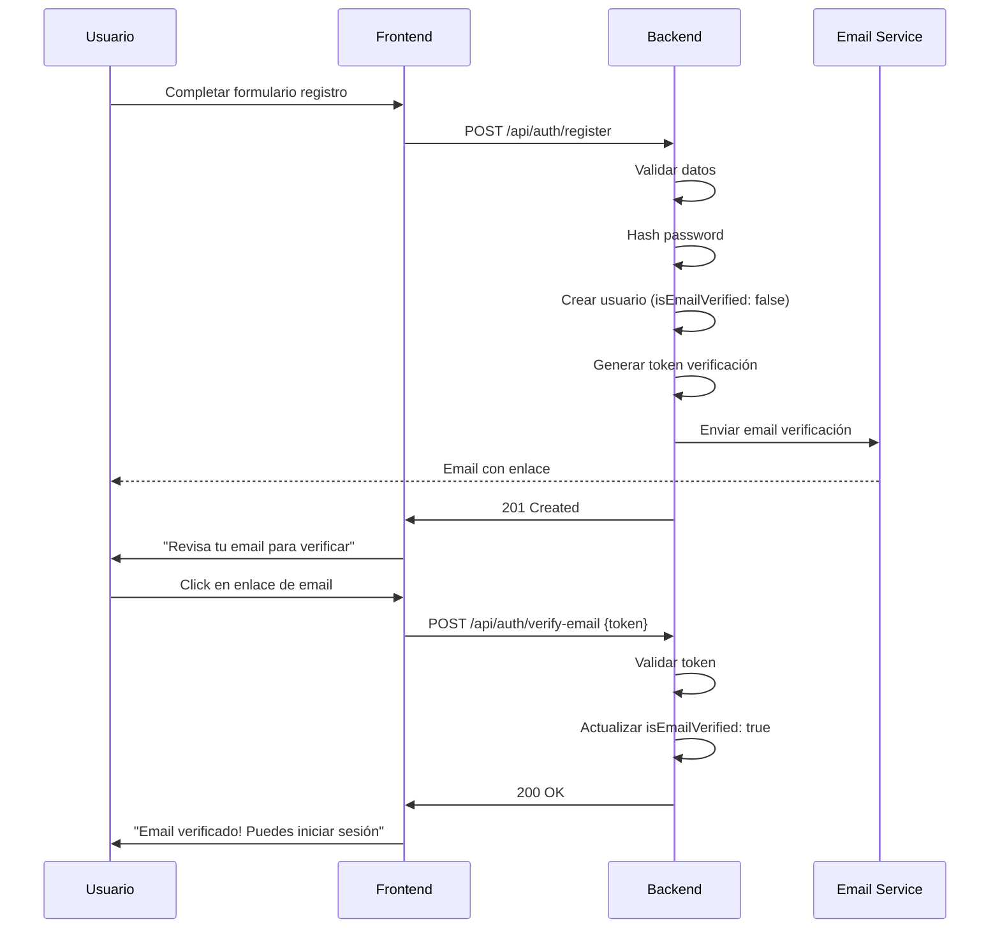
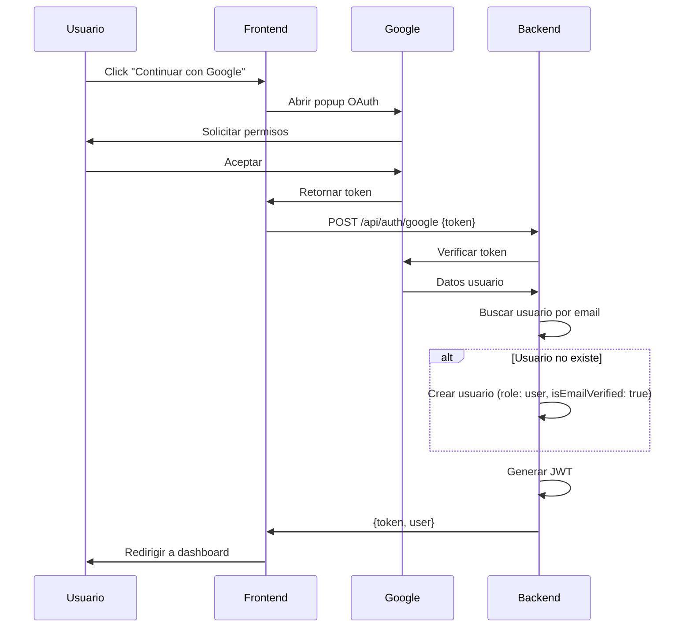
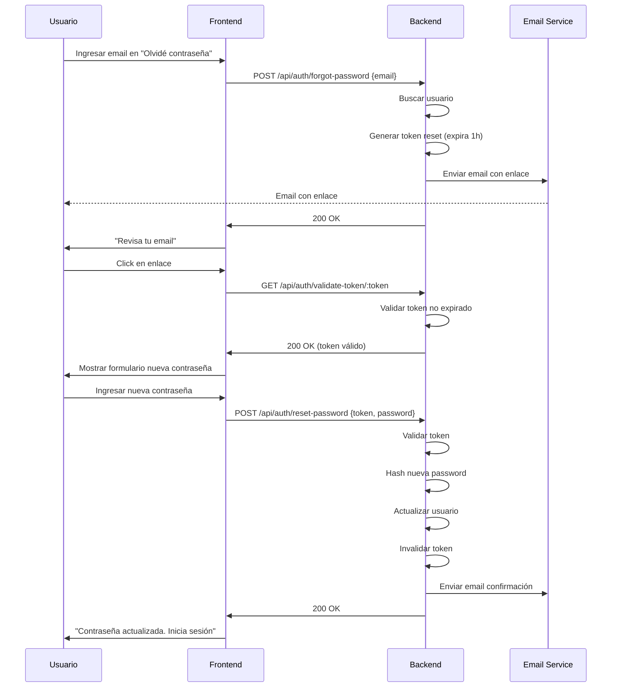

# Plan de Implementación: Sistema de Autenticación y Emails

**Fecha:** 2025-10-18
**Versión:** 1.0.0
**Estado:** Planificación

---

## 📋 Resumen Ejecutivo

Este documento describe la planificación e implementación de:
1. Autenticación con OAuth (Google y Facebook)
2. Sistema de verificación de email
3. Sistema de envío de emails con plantillas
4. Recuperación de contraseña

---

## 🎯 Objetivos

### 1. OAuth (Google/Facebook)
- Permitir registro e inicio de sesión con Google
- Permitir registro e inicio de sesión con Facebook
- Crear usuarios automáticamente con rol `user` por defecto
- Gestionar tokens de OAuth de forma segura

### 2. Verificación de Email
- Enviar email de verificación al registrarse
- Validar cuenta mediante enlace/código
- Permitir reenvío de email de verificación desde admin
- Rol por defecto: `user`

### 3. Sistema de Emails
- Configurar servicio de envío de emails
- Crear plantillas HTML reutilizables
- Header y footer globales configurables
- Vista previa de emails en panel admin
- Tipos de emails:
  - Bienvenida
  - Verificación de cuenta
  - Recuperación de contraseña
  - Cambio de contraseña exitoso
  - Notificaciones (futuro)

### 4. Recuperación de Contraseña
- Solicitar recuperación por email
- Enviar enlace con token temporal
- Validar token y cambiar contraseña
- Expiración de tokens (1 hora)

---

## 🏗️ Arquitectura

### Backend (Node.js + Express + TypeScript)

#### Nuevos Modelos/Schemas

```typescript
// Extensión del modelo User
interface IUser {
  // ... campos existentes
  emailVerificationToken?: string;
  emailVerificationExpires?: Date;
  isEmailVerified: boolean; // ya existe
  resetPasswordToken?: string; // ya existe
  resetPasswordExpires?: Date; // ya existe

  // OAuth
  googleId?: string;
  facebookId?: string;
  authProvider: 'local' | 'google' | 'facebook';
  avatar?: string; // Para foto de perfil de OAuth
}

// Nuevo modelo: EmailTemplate
interface IEmailTemplate {
  name: string; // 'welcome', 'verify-email', 'reset-password', etc.
  subject: string;
  htmlBody: string;
  textBody?: string;
  variables: string[]; // ['userName', 'verificationLink', etc.]
  isActive: boolean;
  createdAt: Date;
  updatedAt: Date;
}

// Nuevo modelo: EmailLog
interface IEmailLog {
  recipient: string;
  subject: string;
  template: string;
  status: 'sent' | 'failed' | 'pending';
  sentAt?: Date;
  error?: string;
  metadata?: any;
}
```

#### Nuevas Rutas

```typescript
// auth.routes.ts - Agregar
POST   /api/auth/google              // OAuth Google
POST   /api/auth/facebook            // OAuth Facebook
POST   /api/auth/verify-email        // Verificar email con token
POST   /api/auth/resend-verification // Reenviar email verificación
POST   /api/auth/forgot-password     // Solicitar recuperación
POST   /api/auth/reset-password      // Resetear con token
GET    /api/auth/validate-token/:token // Validar token reset

// admin/email-templates.routes.ts - Nuevo
GET    /api/admin/email-templates              // Listar plantillas
GET    /api/admin/email-templates/:id          // Obtener plantilla
POST   /api/admin/email-templates              // Crear plantilla
PUT    /api/admin/email-templates/:id          // Actualizar plantilla
DELETE /api/admin/email-templates/:id          // Eliminar plantilla
POST   /api/admin/email-templates/:id/preview  // Vista previa

// admin/email-config.routes.ts - Nuevo
GET    /api/admin/email-config        // Obtener config (header/footer)
PUT    /api/admin/email-config        // Actualizar config

// admin/users.routes.ts - Agregar
POST   /api/admin/users/:id/resend-verification // Reenviar verificación
```

#### Servicios

```typescript
// services/email.service.ts - Extender
class EmailService {
  // Existente
  private transporter: nodemailer.Transporter;

  // Nuevos métodos
  async sendVerificationEmail(user: IUser, token: string): Promise<void>
  async sendPasswordResetEmail(user: IUser, token: string): Promise<void>
  async sendWelcomeEmail(user: IUser): Promise<void>
  async sendPasswordChangedEmail(user: IUser): Promise<void>

  // Utilidades
  private async renderTemplate(templateName: string, variables: object): Promise<string>
  private async logEmail(data: EmailLogData): Promise<void>
}

// services/oauth.service.ts - Nuevo
class OAuthService {
  async verifyGoogleToken(token: string): Promise<GoogleUser>
  async verifyFacebookToken(token: string): Promise<FacebookUser>
  async findOrCreateUser(oauthData: OAuthData): Promise<IUser>
}

// services/token.service.ts - Nuevo
class TokenService {
  generateEmailVerificationToken(): string
  generatePasswordResetToken(): string
  hashToken(token: string): string
  validateToken(token: string, hashedToken: string): boolean
}
```

### Frontend (React + TypeScript)

#### Nuevas Páginas

```typescript
// pages/VerifyEmail.tsx - Nueva
// Página que recibe el token y verifica el email

// pages/admin/EmailTemplates.tsx - Nueva
// Gestión de plantillas de email

// pages/admin/EmailConfig.tsx - Nueva
// Configuración de header/footer global

// pages/admin/EmailPreview.tsx - Nueva
// Vista previa de emails
```

#### Nuevos Componentes

```typescript
// components/auth/SocialLogin.tsx - Nuevo
// Botones de Google/Facebook OAuth

// components/admin/EmailTemplateEditor.tsx - Nuevo
// Editor WYSIWYG para plantillas

// components/admin/EmailPreviewModal.tsx - Nuevo
// Modal para vista previa de emails
```

#### Actualizar Componentes Existentes

```typescript
// pages/Register.tsx - Agregar
// - Botones de OAuth
// - Mensaje "Verifica tu email"

// pages/Login.tsx - Agregar
// - Botones de OAuth

// pages/ForgotPassword.tsx - Ya existe, verificar implementación

// pages/ResetPassword.tsx - Ya existe, verificar implementación
```

---

## 🔧 Tecnologías y Dependencias

### Backend

#### Existentes
- ✅ `nodemailer` - Envío de emails (ya está en package.json)
- ✅ `bcryptjs` - Hash de contraseñas
- ✅ `jsonwebtoken` - JWT tokens
- ✅ `crypto` - Node crypto (nativo)

#### Nuevas a instalar
```bash
npm install --save passport passport-google-oauth20 passport-facebook
npm install --save googleapis
npm install --save handlebars # Para plantillas de email
npm install --save mjml mjml-react # Para emails responsive

npm install --save-dev @types/passport @types/passport-google-oauth20 @types/passport-facebook
```

### Frontend

#### Existentes
- ✅ React
- ✅ React Router
- ✅ React Query

#### Nuevas a instalar
```bash
npm install --save @react-oauth/google
npm install --save react-facebook-login
npm install --save react-quill # Editor WYSIWYG para plantillas
```

### Servicio de Email

**✅ SELECCIONADO: Resend**

**Ventajas:**
- ✅ 100 emails/día gratis (3,000/mes)
- ✅ Excelente experiencia de desarrollo
- ✅ Plantillas con React Components
- ✅ Alta deliverability
- ✅ Estadísticas y tracking
- ✅ Webhooks para eventos
- ✅ API moderna y simple

**Plan gratuito:**
- 100 emails/día
- 3,000 emails/mes
- API completa
- Plantillas ilimitadas

**Instalación:**
```bash
cd la-publica-backend
npm install --save resend
```

---

## 📝 Plan de Implementación

### Fase 1: Sistema de Emails Base (Prioridad Alta) ✅ COMPLETADA
**Tiempo estimado:** 2-3 días
**Tiempo real:** 2 días

#### Backend
1. **Configurar servicio de email**
   - [x] Decidir proveedor (SendGrid/Resend/Nodemailer) → **Resend**
   - [x] Configurar credenciales en `.env`
   - [x] Extender `EmailService` con nuevos métodos
   - [x] Crear modelos `EmailTemplate` y `EmailLog`

2. **Crear plantillas base**
   - [x] Diseñar header/footer global
   - [x] Plantilla: Verificación de email
   - [x] Plantilla: Recuperación de contraseña
   - [x] Plantilla: Bienvenida
   - [x] Plantilla: Contraseña cambiada

3. **Implementar sistema de plantillas**
   - [x] Crear schema de configuración de email (`EmailConfig`)
   - [x] Sistema de variables dinámicas (Handlebars)
   - [x] Compilador de plantillas → `EmailService.wrapEmailContent()`

#### Frontend
4. **Panel de administración**
   - [x] Página de gestión de plantillas (`EmailTemplates.tsx`)
   - [x] Editor de plantillas (React-Quill) con modo visual y código
   - [x] Vista previa de emails
   - [x] Configuración de header/footer global (tab "Configuració Global")

### Fase 2: Verificación de Email (Prioridad Alta) ✅ COMPLETADA
**Tiempo estimado:** 1-2 días
**Tiempo real:** 1 día

#### Backend
1. **Actualizar modelo User**
   - [x] Agregar campos `emailVerificationToken` y `emailVerificationExpires`
   - [x] Método `generateEmailVerificationToken()` → Implementado en auth.controller.ts

2. **Implementar endpoints**
   - [x] `POST /api/auth/verify-email` - Verificar con token (línea 358)
   - [x] `POST /api/auth/resend-verification` - Reenviar email (línea 407)
   - [x] Tests automatizados con Jest (14 tests, 12 pasando)

3. **Integrar con registro**
   - [x] Generar token al registrarse
   - [x] Enviar email de verificación automáticamente
   - [x] Marcar `isEmailVerified: false` por defecto
   - [x] Bloquear login si email no verificado (403 Forbidden)

#### Frontend
4. **Páginas y componentes**
   - [x] Página `VerifyEmail.tsx` para validar token → Ya existe
   - [x] Mensaje en login si no está verificado → Implementado en backend
   - [ ] Botón "Reenviar email" en perfil (pendiente frontend)
   - [ ] Botón "Reenviar verificación" en admin (pendiente frontend)

### Fase 3: Recuperación de Contraseña (Prioridad Alta) ✅ COMPLETADA
**Tiempo estimado:** 1-2 días
**Tiempo real:** 1 día

#### Backend
1. **Endpoints** (ya parcialmente implementados)
   - [x] Verificar `POST /api/auth/forgot` → Funciona correctamente
   - [x] Verificar `POST /api/auth/reset-password` → Funciona correctamente
   - [x] Tests automatizados con Jest (13 tests, todos pasando)

2. **Lógica de negocio**
   - [x] Generar token con expiración (1 hora)
   - [x] Enviar email con enlace
   - [x] Validar token antes de resetear
   - [x] Invalidar token después de usar

#### Frontend
3. **Páginas** (ya existen, verificar)
   - [x] Verificar `ForgotPassword.tsx` → Completa y funcional
   - [x] Verificar `ResetPassword.tsx` → Completa y funcional
   - [x] Agregar validación de token → Implementada
   - [x] Mensajes de éxito/error → Implementados
   - [x] Corrección de bugs CSS (top-1/2)

### Fase 4: OAuth (Google/Facebook) (Prioridad Media)
**Tiempo estimado:** 3-4 días

#### Backend
1. **Configurar OAuth**
   - [ ] Registrar app en Google Cloud Console
   - [ ] Registrar app en Facebook Developers
   - [ ] Configurar credenciales en `.env`
   - [ ] Instalar y configurar Passport.js

2. **Actualizar modelo User**
   - [ ] Agregar campos `googleId`, `facebookId`, `authProvider`
   - [ ] Hacer password opcional para OAuth
   - [ ] Agregar campo `avatar` para foto de perfil

3. **Implementar endpoints**
   - [ ] `POST /api/auth/google` - Login con Google
   - [ ] `POST /api/auth/facebook` - Login con Facebook
   - [ ] Crear servicio `OAuthService`

4. **Lógica de creación de usuarios**
   - [ ] Buscar usuario existente por email
   - [ ] Crear nuevo usuario si no existe
   - [ ] Asignar rol `user` por defecto
   - [ ] Marcar como `isEmailVerified: true` (confiamos en OAuth)
   - [ ] Generar JWT y retornar

#### Frontend
5. **Componentes y páginas**
   - [ ] Componente `SocialLogin.tsx`
   - [ ] Botones de Google/Facebook en `Login.tsx`
   - [ ] Botones de Google/Facebook en `Register.tsx`
   - [ ] Configurar Google OAuth Client
   - [ ] Configurar Facebook SDK

---

## 🔐 Seguridad

### Tokens
- **Email Verification Token:**
  - Longitud: 32 bytes (crypto.randomBytes)
  - Expiración: 24 horas
  - Un solo uso

- **Password Reset Token:**
  - Longitud: 32 bytes
  - Expiración: 1 hora
  - Un solo uso
  - Invalidar al cambiar contraseña

### OAuth
- Verificar tokens en backend
- No confiar en datos del frontend
- Validar email del proveedor OAuth
- Manejar casos de email duplicado

### Emails
- No incluir información sensible en emails
- URLs con tokens en query params
- HTTPS obligatorio en producción
- Rate limiting en endpoints de envío

---

## 📧 Plantillas de Email

### Estructura de Plantilla

```html
<!DOCTYPE html>
<html>
<head>
  <meta charset="utf-8">
  <meta name="viewport" content="width=device-width, initial-scale=1.0">
  <title>{{subject}}</title>
</head>
<body style="margin: 0; padding: 0; font-family: Arial, sans-serif;">
  <!-- HEADER GLOBAL -->
  <table width="100%" cellpadding="0" cellspacing="0">
    <tr>
      <td align="center" bgcolor="#4F8FF7" style="padding: 20px;">
        
      </td>
    </tr>
  </table>

  <!-- CONTENIDO DINÁMICO -->
  <table width="100%" cellpadding="0" cellspacing="0" style="max-width: 600px; margin: 0 auto;">
    <tr>
      <td style="padding: 40px 20px;">
        {{{content}}}
      </td>
    </tr>
  </table>

  <!-- FOOTER GLOBAL -->
  <table width="100%" cellpadding="0" cellspacing="0" bgcolor="#f5f5f5">
    <tr>
      <td align="center" style="padding: 20px;">
        <p style="color: #666; font-size: 14px;">
          © {{year}} La Pública. Tots els drets reservats.
        </p>
        <p style="color: #666; font-size: 12px;">
          {{footerText}}
        </p>
      </td>
    </tr>
  </table>
</body>
</html>
```

### Tipos de Emails

1. **Verificación de Email**
   - Variables: `{firstName}`, `{verificationLink}`, `{verificationCode}`
   - Asunto: "Verifica el teu compte a La Pública"

2. **Recuperación de Contraseña**
   - Variables: `{firstName}`, `{resetLink}`, `{expirationTime}`
   - Asunto: "Restableix la teva contrasenya"

3. **Bienvenida**
   - Variables: `{firstName}`, `{profileLink}`
   - Asunto: "Benvingut/da a La Pública!"

4. **Contraseña Cambiada**
   - Variables: `{firstName}`, `{changeDate}`
   - Asunto: "La teva contrasenya ha estat canviada"

---

## 🧪 Testing

### Backend
```typescript
// tests/auth/oauth.test.ts
describe('OAuth Authentication', () => {
  it('should create user with Google OAuth')
  it('should login existing user with Google')
  it('should handle invalid Google token')
  // ...
})

// tests/auth/email-verification.test.ts
describe('Email Verification', () => {
  it('should send verification email on register')
  it('should verify email with valid token')
  it('should reject expired token')
  // ...
})
```

### Frontend
```typescript
// tests/components/SocialLogin.test.tsx
describe('SocialLogin Component', () => {
  it('should render Google and Facebook buttons')
  it('should handle Google login success')
  it('should handle login error')
})
```

---

## 📊 Variables de Entorno

```bash
# OAuth
GOOGLE_CLIENT_ID=xxx
GOOGLE_CLIENT_SECRET=xxx
GOOGLE_CALLBACK_URL=http://localhost:3000/api/auth/google/callback

FACEBOOK_APP_ID=xxx
FACEBOOK_APP_SECRET=xxx
FACEBOOK_CALLBACK_URL=http://localhost:3000/api/auth/facebook/callback

# Email Service - Resend
RESEND_API_KEY=re_xxxxxxxxxxxxxxxxxxxxx
EMAIL_FROM=noreply@lapublica.cat
EMAIL_FROM_NAME=La Pública

# URLs
FRONTEND_URL=http://localhost:5173
BACKEND_URL=http://localhost:3000

# Tokens
EMAIL_VERIFICATION_EXPIRY=24h
PASSWORD_RESET_EXPIRY=1h
```

---

## 📱 Flujos de Usuario

### Flujo 1: Registro con Email



### Flujo 2: Registro con Google OAuth



### Flujo 3: Recuperación de Contraseña



---

## 🎨 Diseño de Emails

### Principios de Diseño
- **Mobile First:** 100% responsive
- **Simplicidad:** Mensaje claro y acción única
- **Accesibilidad:** Alto contraste, texto alt en imágenes
- **Branding:** Colores y logo de La Pública

### Colores
- Primario: `#4F8FF7` (azul)
- Secundario: `#F5F5F5` (gris claro)
- Texto: `#333333`
- Enlaces: `#4F8FF7`

### Botones CTA
```html
<a href="{{actionUrl}}" style="
  display: inline-block;
  padding: 12px 30px;
  background-color: #4F8FF7;
  color: white;
  text-decoration: none;
  border-radius: 6px;
  font-weight: bold;
">
  {{actionText}}
</a>
```

---

## 📈 Métricas y Monitoreo

### KPIs
- Tasa de verificación de email (objetivo: >80%)
- Tiempo promedio de verificación
- Tasa de recuperación de contraseña exitosa
- Tasa de registro con OAuth vs email
- Tasa de deliverability de emails (objetivo: >95%)

### Logs
- Todos los emails enviados → `EmailLog` collection
- Errores de OAuth → Sistema de logs
- Tokens generados y usados → Logs de seguridad

---

## ✅ Checklist de Implementación

### Antes de Empezar
- [ ] Confirmar servicio de email a usar
- [ ] Obtener credenciales de OAuth (Google, Facebook)
- [ ] Diseñar plantillas de email (aprobación)
- [ ] Definir textos en catalán para todos los emails

### Durante Desarrollo
- [ ] Probar envío de emails en desarrollo
- [ ] Validar tokens y expiración
- [ ] Testing de flujos completos
- [ ] Revisar seguridad y rate limiting

### Antes de Producción
- [ ] Configurar DNS (SPF, DKIM, DMARC)
- [ ] Validar dominios en servicio de email
- [ ] Probar deliverability
- [ ] Configurar variables de entorno producción
- [ ] Documentar proceso de recuperación

---

## 🚀 Despliegue

### Desarrollo
1. Configurar `.env.local` con credenciales de desarrollo
2. Usar Gmail SMTP o modo sandbox de SendGrid
3. Emails solo a direcciones de prueba

### Staging
1. Usar credenciales de staging
2. Validar dominio de staging
3. Testing completo de flujos

### Producción
1. Configurar credenciales de producción
2. Validar dominio `lapublica.cat`
3. Configurar registros DNS
4. Monitorear deliverability

---

## 📚 Recursos

### Documentación OAuth
- [Google OAuth 2.0](https://developers.google.com/identity/protocols/oauth2)
- [Facebook Login](https://developers.facebook.com/docs/facebook-login)
- [Passport.js](http://www.passportjs.org/)

### Servicios de Email
- [SendGrid Docs](https://docs.sendgrid.com/)
- [Resend Docs](https://resend.com/docs)
- [Nodemailer](https://nodemailer.com/)

### Diseño de Emails
- [MJML Framework](https://mjml.io/)
- [Email on Acid](https://www.emailonacid.com/)
- [Can I Email](https://www.caniemail.com/)

---

## 🤔 Decisiones Pendientes

1. ✅ **Servicio de Email:** **Resend** (CONFIRMADO)
2. **Editor de Plantillas:** ¿WYSIWYG simple o editor de código?
3. **Verificación Obligatoria:** ¿Bloquear login sin verificar email?
4. **OAuth:** ¿Solo Google/Facebook o agregar más providers (Twitter, LinkedIn)?
5. **Idioma:** ¿Solo catalán o multiidioma en emails?

---

## 📞 Próximos Pasos

1. **Revisar y aprobar este plan**
2. **Decidir servicio de email**
3. **Obtener credenciales de OAuth**
4. **Diseñar plantillas de email (mockups)**
5. **Comenzar Fase 1: Sistema de Emails Base**

---

**Última actualización:** 2025-10-18
**Próxima revisión:** Después de aprobación inicial
